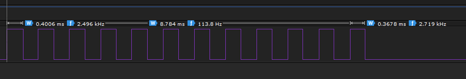

# Learning test project

- [Learning test project](#learning-test-project)
    - [Список Ссылок на информацию о протоколе KeeLoq](#%D1%81%D0%BF%D0%B8%D1%81%D0%BE%D0%BA-%D1%81%D1%81%D1%8B%D0%BB%D0%BE%D0%BA-%D0%BD%D0%B0-%D0%B8%D0%BD%D1%84%D0%BE%D1%80%D0%BC%D0%B0%D1%86%D0%B8%D1%8E-%D0%BE-%D0%BF%D1%80%D0%BE%D1%82%D0%BE%D0%BA%D0%BE%D0%BB%D0%B5-keeloq)
    - [STM32 Flash info](#stm32-flash-info)
    - [Code snippets](#code-snippets)


[](http://gimran.ru)


## Список Ссылок на информацию о протоколе KeeLoq

- [Описание протокола на форуме](http://phreakerclub.com/forum/showthread.php?t=1094)
- 

## STM32 Flash info
- [общее описание на CMSIS easystm32.ru](http://easystm32.ru/for-beginners/38-flash-stm32)


## Code snippets
```

```


| column1 | column2 | column 3 |
| ------- | ------- | -------- |
| sdfsdf  | sdfsdf  | sdfdsf   |

**GPIO**
```
LL_GPIO_SetOutputPin(GPIOx, GPIO_Pin_x);
```


[//]: # (Пример использования define в markdown sintax Thanks SO - http://stackoverflow.com/questions/4823468/store-comments-in-markdown-syntax)


   [dill]: <https://github.com/joemccann/dillinger>
   [git-repo-url]: <https://github.com/joemccann/dillinger.git>
   [john gruber]: <http://daringfireball.net>

